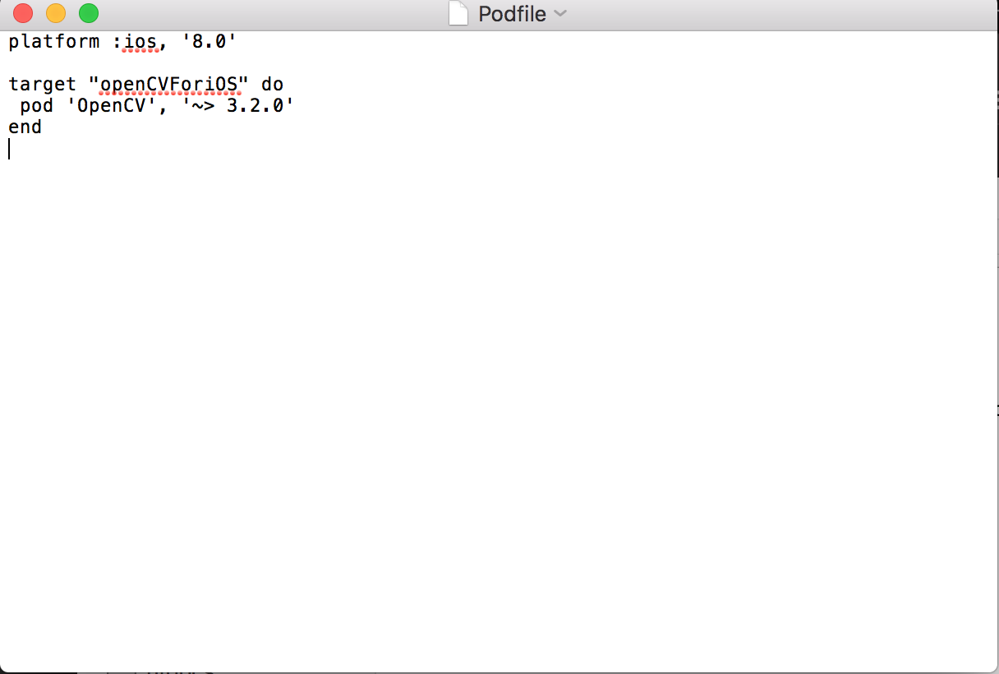

## 前言
使用 C++ API 并不是绝大多数 iOS 开发者每天都做的事，你需要使用 Objective-C++ 文件来调用 OpenCV 的函数。 也就是说，你不能在 Swift 或者 Objective-C 语言内调用 OpenCV 的函数。 这篇 OpenCV 的 iOS 教程告诉你只要把所有用到 OpenCV 的类的文件后缀名改为 .mm 就行了，包括视图控制器类也是如此。这么干或许能行得通，却不是什么好主意。正确的方式是给所有你要在 app 中使用到的 OpenCV 功能写一层 Objective-C++ 封装。这些 Objective-C++ 封装把 OpenCV 的 C++ API 转化为安全的 Objective-C API，以方便地在所有 Objective-C 类中使用。走封装的路子，你的工程中就可以只在这些封装中调用 C++ 代码，从而避免掉很多让人头痛的问题，比如直接改文件后缀名会因为在错误的文件中引用了一个 C++ 头文件而产生难以追踪的编译错误。 
## 在新建项目中集成openCV
这里我选择使用cocoapods集成,关于cocoapods的使用，请参考[这篇文章](http://blog.csdn.net/u012505605/article/details/52437360)这是我的Podfile文件

## Objective-C++
如前面所说，OpenCV 是一个 C++ 的 API，因此不能直接在 Swift 和 Objective-C 代码中使用，但能在 Objective-C++ 文件中使用。

Objective-C++ 是 Objective-C 和 C++ 的混合物，让你可以在 Objective-C 类中使用 C++ 对象。clang 编译器会把所有后缀名为 .mm 的文件都当做是 Objective-C++。一般来说，它会如你所期望的那样运行，但还是有一些使用 Objective-C++ 的注意事项。内存管理是你最应该格外注意的点，因为 ARC 只对 Objective-C 对象有效。当你使用一个 C++ 对象作为类属性的时候，其唯一有效的属性就是 assign。因此，你的 dealloc 函数应确保 C++ 对象被正确地释放了。

第二重要的点就是，如果你在 Objective-C++ 头文件中引入了 C++ 头文件，当你在工程中使用该 Objective-C++ 文件的时候就泄露了 C++ 的依赖。任何引入你的 Objective-C++ 类的 Objective-C 类也会引入该 C++ 类，因此该 Objective-C 文件也要被声明为 Objective-C++ 的文件。这会像森林大火一样在工程中迅速蔓延。所以，应该把你引入 C++ 文件的地方都用 #ifdef __cplusplus 包起来，并且只要可能，就尽量只在 .mm 实现文件中引入 C++ 头文件。

