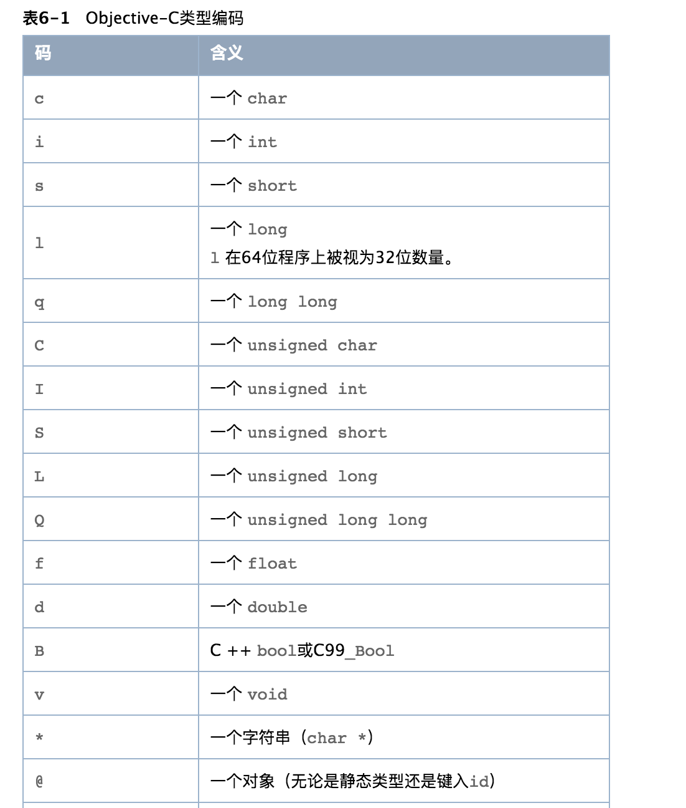
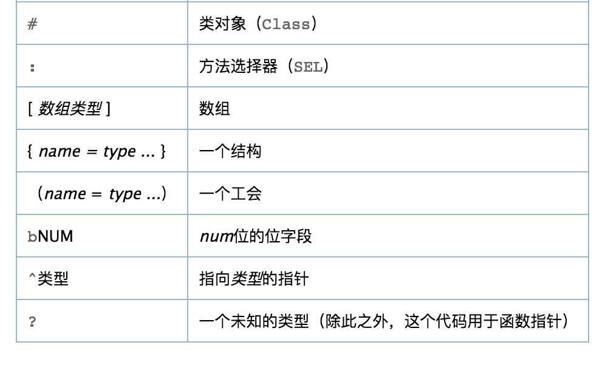

 当编译器遇到一个属性（Property）声明时（参考Objective-C 2.0 程序设计语言中的属性小节），编译器将产生一些描述性的元数据与属性所在的类或者协议类关联。您可以通过函数访问元数据，这些函数支持在类或者协议类中通过名字来查找，通过@encode获得属性的类型编码，将属性的特征（Attribute）作为C字符串的数组返回等。每个类或者协议类都维护了一个声明了的属性列表。 
 <!--more-->
## 属性类型和相关函数 
属性（Property）类型定义了对描述属性的结构体objc_property的不透明的句柄。 
```objc
typedef struct objc_property *Property; 
```
 您可以使用函数class_copyPropertyList和protocol_copyPropertyList来获得类（包括范畴类）或者协议类中的属性列表： 
```objc
objc_property_t *class_copyPropertyList(Class cls, unsigned int *outCount) objc_property_t *protocol_copyPropertyList(Protocol *proto, unsigned int *outCount) 
```
例如，有如下的类声明： 
```objc
@interface Lender : NSObject
 {     
      float alone;
 }
@property float alone;
@end 
```
 您可以象这样获得它的属性： 
```objc
 id LenderClass = objc_getClass("Lender");
 unsigned int outCount; objc_property_t *properties =   class_copyPropertyList(LenderClass, &outCount); 
```
 您还可以通过property_getName函数获得属性的名字： 
```objc
const char *property_getName(objc_property_t property)
```
 函数class_getProperty和protocol_getProperty则在类或者协议类中返回具有给定名字的属性的引用： 
```objc
objc_property_t class_getProperty(Class cls, const char *name) objc_property_t protocol_getProperty(Protocol *proto, const char *name, BOOL isRequiredProperty, BOOL isInstanceProperty) 
```
通过property_getAttributes函数可以获得属性的名字和@encode编码。关于类型编码的更多细节，参考“类型编码“一节；关于属性的类型编码，见“属性类型编码”及“属性特征的描述范例”。 
```objc
const char *property_getAttributes(objc_property_t property) 
```
综合起来，您可以通过下面的代码得到一个类中所有的属性。 
```objc
 id LenderClass = objc_getClass("Lender");
unsigned int outCount, i; objc_property_t *properties = class_copyPropertyList(LenderClass, &outCount);
 for (i = 0; i < outCount; i++) {
      objc_property_t property = properties[i]; 
      fprintf(stdout, "%s %s\n", property_getName(property), property_getAttributes(property));
 } 
```
## 属性类型编码
以及其它特征（Attribute）。
*   property_getAttributes返回的字符串以字母T开始，接着是@encode编码和逗号。
*   如果属性有readonly修饰，则字符串中含有R和逗号。  
*   如果属性有copy或者retain修饰，则字符串分别含有C或者&，然后是逗号。  
*   如果属性定义有定制的getter和setter方法，则字符串中有G或者S跟着相应的方法名以及逗号（例如，GcustomGetter，ScustomSetter:,，）。 如果属性是只读的，且有定制的get访问方法，则描述到此为止。 
*   字符串以V然后是属性的名字结束。 范例请参考 “属性特征的描述范例”一节。 
## 属性特征的描述范例
给定如下定义： 
```objc
enum FooManChu { FOO, MAN, CHU };
struct YorkshireTeaStruct { int pot; char lady; };
typedef struct YorkshireTeaStruct YorkshireTeaStructType;
union MoneyUnion { float alone; double down; }; 
```
下表给出了属性（Property）声明以及property_getAttributes返回的相应的字符串： 



