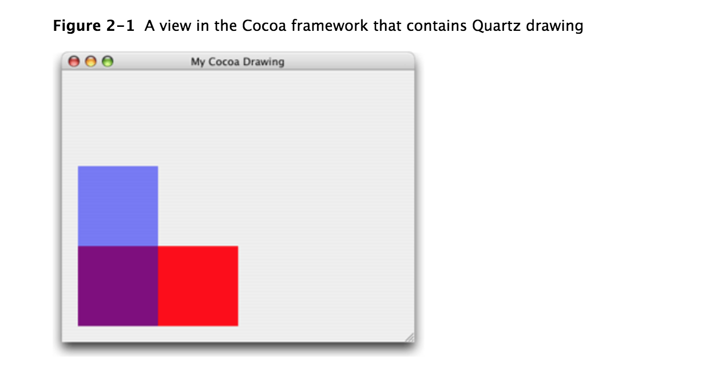
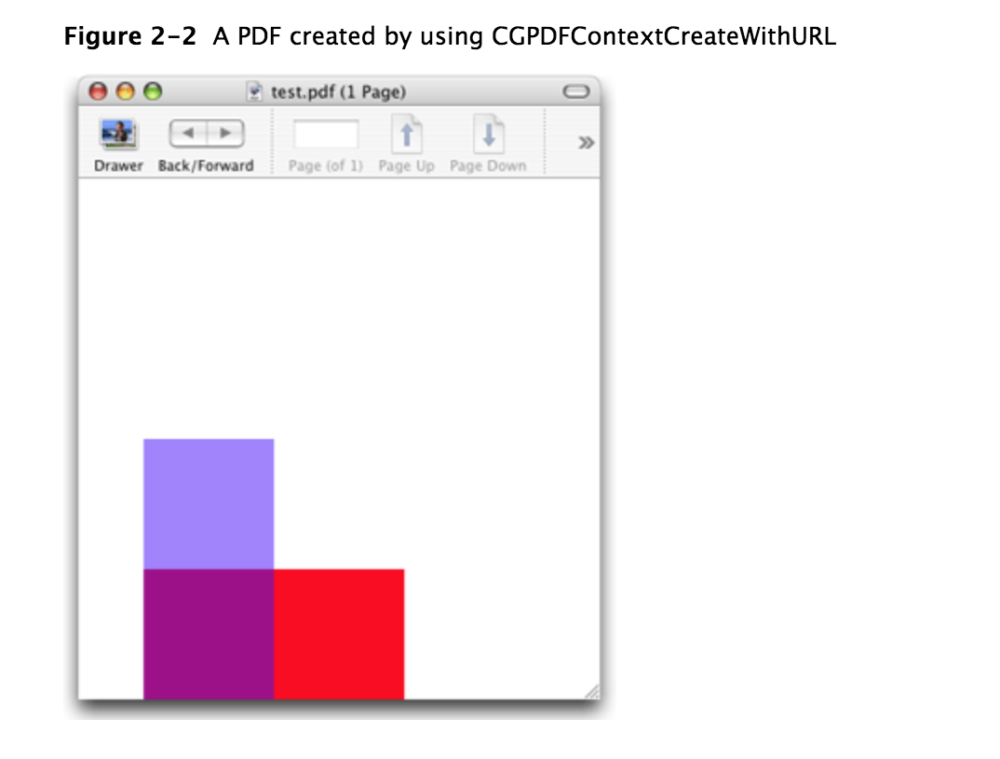
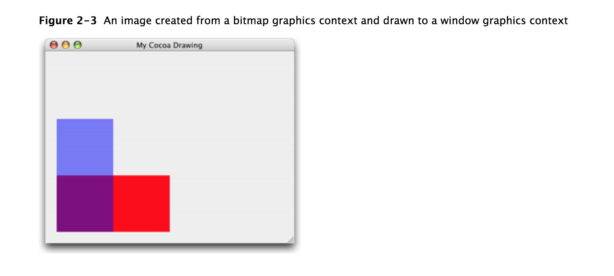
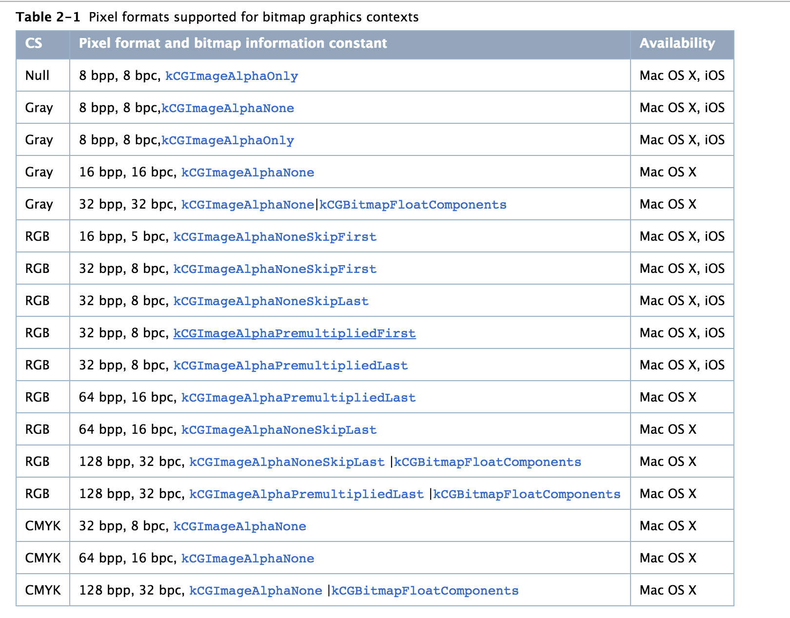

一个图形上下文(Graphics Context)表示一个绘制目标。它包含绘制系统用于完成绘制指令的绘制参数和设备相关信息。图形上下文(Graphics Context)定义了基本的绘制属性，如颜色、裁减区域、线条宽度和样式信息、字体信息、混合模式等。
<!--more-->
我们可以通过几种方式来获取图形上下文(Graphics Context)：Quartz提供的创建函数、Mac OS X框架或IOS的UIKit框架提供的函数。Quartz提供了多种Graphics Context的创建函数，包括bitmap和PDF，我们可以使用这些Graphics Context创建自定义的内容。

本章介绍如何为不同的绘图目标创建图形上下文(Graphics Context)。在代码中，我们用CGContextRef来表示一个图形上下文(Graphics Context)，当获得一个Graphics Context后，可以使用Quartz 2D函数在上下文(context)中进行绘制、完成操作(如平移)、修改图形状态参数(如线宽和填充颜色)等。
## 在iOS中的视图图形上下文(Graphics Context)进行绘制
在iOS应用程序中，如果要在屏幕上进行绘制，需要创建一个UIView对象，并实现它的drawRect:方法。视图的drawRect：方法在视图显示在屏幕上及它的内容需要更新时被调用。在调用您的自定义drawRect：方法之前，视图对象自动配置其绘图环境，以便您的代码可以立即开始绘制。作为此配置的一部分，UIView对象为当前绘图环境创建一个图形上下文（CGContextRef）。通过调用UIKit函数UIGraphicsGetCurrentContext，在drawRect：方法中获得此图形上下文。

UIKit中使用的默认坐标系与Quartz使用的坐标系不同。在UIKit中，原点位于左上角，y轴正方向为向下。 UIView通过将修改Quartz的Graphics Context的CTM[原点平移到左下角，同时将y轴反转(y值乘以-1)]以使其与UIView匹配。有关修改坐标系的更多信息以及您自己绘图代码的含义，请参阅Quartz 2D坐标系。

UIView对象在“[iOS编程指南](https://developer.apple.com/library/content/documentation/WindowsViews/Conceptual/ViewPG_iPhoneOS/Introduction/Introduction.html#//apple_ref/doc/uid/TP40009503)”中有详细介绍。
## 在Mac OS X中创建一个窗口Graphics Context
在Mac OS X中绘图时，您需要创建一个窗口图形上下文(Graphics Context)。 Quartz 2D API本身不提供获取窗口的图形上下文的函数。 而是使用Cocoa框架来获取在Cocoa中创建的窗口的上下文。

您可以使用下面的代码行从Cocoa应用程序的drawRect：例程中获取一个Quartz图形上下文：
```objc
 CGContextRef myContext = [[NSGraphicsContext currentContext] graphicsPort];
```
currentContext方法返回当前线程的NSGraphicsContext实例。 graphicsPort方法返回一个低级别、平台相关的Graphics Context(Quartz Graphics Context)。 （不要被方法名称弄糊涂，它们是历史的。）有关更多信息，请参阅NSGraphicsContext类参考。

在获取到图形上下文(Graphics Context)后，可以调用Cocoa应用程序中的任何Quartz 2D绘图函数。我们还可以将Quartz 2D调用与Cocoa绘图调用混合使用。 如图2-1，可以看到一个在Cocoa视图中用Quartz 2D绘制的实例。 绘图由两个长方形组成(一个不透明的红色长方形和半透明的蓝色长方形)。 您将了解有关“颜色和颜色空间”中的透明度的更多信息。 能够控制多少“透视”颜色是Quartz 2D的标志性特征之一。

为了实现图2-1实例，需要先创建一个Cocoa应用程序。在Interface Builder中，拖动一个Custom View到窗口中，并子类化。然后实现子类视图的，如代码清单2-1所示。视图的drawRect:包含了所有的Quartz绘制代码。

注：NSView的drawRect:方法在每次视图需要绘制时自动调用。
Listing 2-1 绘制到窗口图形上下文
```objc
@implementation MyQuartzView
 
- (id)initWithFrame:(NSRect)frameRect
{
    self = [super initWithFrame:frameRect];
    return self;
}
 
- (void)drawRect:(NSRect)rect
{
    CGContextRef myContext = [[NSGraphicsContext // 1
                                currentContext] graphicsPort];
   // ********** Your drawing code here ********** // 2
    CGContextSetRGBFillColor (myContext, 1, 0, 0, 1);// 3
    CGContextFillRect (myContext, CGRectMake (0, 0, 200, 100 ));// 4
    CGContextSetRGBFillColor (myContext, 0, 0, 1, .5);// 5
    CGContextFillRect (myContext, CGRectMake (0, 0, 100, 200));// 6
  } 
@end
```
代码说明：
    1. 为视图获取一个Graphics Context
    2. 插入绘图代码的地方。以下四行是使用Quartz 2D函数的例子
    3. 设置完全不透明的红色填充色。
    4. 填充一个长方形，其原点为(0, 0), 大小为(200, 100)
    5. 设置半透明的蓝色填充色。
    6. 填充一个长方形，其原点为(0, 0), 大小为(100, 200)
## 创建一个PDF Graphics Context
当您创建PDF图形上下文并绘制时，Quartz将绘制操作记录为一系列的PDF绘制命令并写入文件中。我们需要提供一个PDF输出的位置及一个默认的media box(用于指定页面边界的长方形)。图2-2显示了在PDF Graphics Context中绘制及在preview打开PDF的结果。

Quartz 2D API提供了两个创建PDF图形上下文的函数：

CGPDFContextCreateWithURL:当你需要用Core Foundation URL指定pdf输出的位置时使用该函数。代码清单2-2显示了该函数的使用方法：
CGPDFContextCreate，当需要将pdf输出发送给数据用户时使用该方法。代码清单2-3显示了该函数的使用方法：
【iOS注意】iOS中的PDF图形上下文使用Quartz提供的默认坐标系，而不应用转换来匹配UIKit坐标系。 如果您的应用程序计划在PDF图形上下文和UIView对象提供的图形上下文之间共享绘图代码，则应用程序应修改PDF图形上下文的CTM以修改坐标系。 请参阅Quartz二维坐标系统
Listing 2-2  Calling CGPDFContextCreateWithURL to create a PDF graphics context
```objc
CGContextRef MyPDFContextCreate (const CGRect *inMediaBox,
                                    CFStringRef path)
{
    CGContextRef myOutContext = NULL;
    CFURLRef url;
 
    url = CFURLCreateWithFileSystemPath (NULL, // 1
                                path,
                                kCFURLPOSIXPathStyle,
                                false);
    if (url != NULL) {
        myOutContext = CGPDFContextCreateWithURL (url,// 2
                                        inMediaBox,
                                        NULL);
        CFRelease(url);// 3
    }
    return myOutContext;// 4
}
```
代码解释如下：

1.     调用Core Foundation函数从提供给MyPDFContextCreate函数的CFString对象创建一个CFURL对象。 您传递NULL作为使用默认分配器的第一个参数。 您还需要指定一个路径样式，在这个例子中是一个POSIX样式的路径名。
2.     调用Quartz 2D函数，使用刚刚创建的PDF位置（作为CFURL对象）和指定PDF边界的矩形创建PDF图形上下文。 矩形（CGRect）被传递给MyPDFContextCreate函数，并且是PDF的默认页面媒体边界框。
3.     释放CFURL对象。
4.     返回PDF图形上下文。 调用者必须在不再需要的时候释放图形上下文。

Listing 2-3  Calling CGPDFContextCreate to create a PDF graphics context
```objc
CGContextRef MyPDFContextCreate (const CGRect *inMediaBox,
                                    CFStringRef path)
{
    CGContextRef        myOutContext = NULL;
    CFURLRef            url;
    CGDataConsumerRef   dataConsumer;
 
    url = CFURLCreateWithFileSystemPath (NULL, // 1
                                        path,
                                        kCFURLPOSIXPathStyle,
                                        false);
 
    if (url != NULL)
    {
        dataConsumer = CGDataConsumerCreateWithURL (url);// 2
        if (dataConsumer != NULL)
        {
            myOutContext = CGPDFContextCreate (dataConsumer, // 3
                                        inMediaBox,
                                        NULL);
            CGDataConsumerRelease (dataConsumer);// 4
        }
        CFRelease(url);// 5
    }
    return myOutContext;// 6
}
```
代码翻译如下：

    1. 调用Core Foundation函数从提供给MyPDFContextCreate函数的CFString对象创建一个CFURL对象。您传递NULL作为使用默认分配器的第一个参数。您还需要指定一个路径样式，在这个例子中是一个POSIX样式的路径名。
    2. 使用CFURL对象创建一个Quartz数据使用者对象。如果您不想使用CFURL对象（例如，您希望将PDF数据置于无法由CFURL对象指定的位置），则可以使用一组回调函数创建数据使用者你在你的应用程序中实现。有关更多信息，请参阅Quartz 2D中的数据管理。
    3. 调用Quartz 2D函数来创建一个PDF图形上下文，作为参数传递给MyPDFContextCreate函数的数据使用者和矩形（类型为CGRect）。此矩形是PDF的默认页面媒体边界框。
    4. 释放数据使用者。
    5. 释放CFURL对象。
    6. 返回PDF图形上下文。调用者必须在不再需要的时候释放图形上下文
清单2-4显示了如何调用MyPDFContextCreate例程并对其进行绘制。 清单后面出现每行编号的详细说明
```objc
 CGRect mediaBox;// 1
    mediaBox = CGRectMake (0, 0, myPageWidth, myPageHeight);// 2
    myPDFContext = MyPDFContextCreate (&mediaBox, CFSTR("test.pdf"));// 3
    CFStringRef myKeys[1];// 4
    CFTypeRef myValues[1];
    myKeys[0] = kCGPDFContextMediaBox;
    myValues[0] = (CFTypeRef) CFDataCreate(NULL,(const UInt8 *)&mediaBox, sizeof (CGRect));
    CFDictionaryRef pageDictionary = CFDictionaryCreate(NULL, (const void **) myKeys,
                                                        (const void **) myValues, 1,
                                                        &kCFTypeDictionaryKeyCallBacks,
                                                        & kCFTypeDictionaryValueCallBacks);
    CGPDFContextBeginPage(myPDFContext, &pageDictionary);// 5
        // ********** Your drawing code here **********// 6
        CGContextSetRGBFillColor (myPDFContext, 1, 0, 0, 1);
        CGContextFillRect (myPDFContext, CGRectMake (0, 0, 200, 100 ));
        CGContextSetRGBFillColor (myPDFContext, 0, 0, 1, .5);
        CGContextFillRect (myPDFContext, CGRectMake (0, 0, 100, 200 ));
    CGPDFContextEndPage(myPDFContext);// 7
    CFRelease(pageDictionary);// 8
    CFRelease(myValues[0]);
    CGContextRelease(myPDFContext);
```
代码如下：
    1. 声明一个用于定义PDF媒体框的矩形的变量。
    2. 将媒体框的原点设置为（0,0），并将宽度和高度设置为由应用程序提供的变量。
    3. 调用函数MyPDFContextCreate（请参阅清单2-3）以获取PDF图形上下文，提供媒体框和路径名。宏CFSTR将字符串转换为CFStringRef数据类型。
    4. 使用页面选项设置字典。在这个例子中，只有媒体框被指定。您不必传递用于设置PDF图形上下文的同一个矩形。您在此处添加的媒体框取代了您传递的设置PDF图形上下文的矩形。
    5. 指示页面的开始。此功能用于面向页面的图形，这是PDF图纸。
    6. 调用Quartz 2D绘图功能。用适合您的应用程序的绘图代码替换此代码和以下四行代码。
    7. 指示PDF页面的结尾。
    8. 不再需要时，释放字典和PDF图形上下文
## 创建一个位图图形上下文(Graphics Context)
一个位图图形上下文(bitmap Graphics Context)接受指向内存缓存(包含位图存储空间)的指针。当我们绘制一个位图Graphics Context时，该缓存被更新。在释放Graphics Context后，我们将得到一个我们指定像素格式的全新的位图。
【注】位图Graphics Context有时用于后台绘制。CGLayer对象优化了后台绘制，因为Quartz在显卡上缓存了层。 
【iOS注】iOS应用程序应该使用函数UIGraphicsBeginImageContextWithOptions取代Quartz低层函数。 如果您的应用程序使用Quartz创建离屏位图，则位图图形上下文使用的坐标系是默认的Quartz坐标系。 相比之下，而使用UIGraphicsBeginImageContextWithOptions创建图形上下文，UIKit将会对坐标系统使用与UIView对象的图形上下文一样的转换。这允许应用程序使用相同的绘制代码而不需要担心坐标系统问题。虽然我们的应用程序可以手动调整CTM达到相同的效果，但这种做没有性能优势。

我们使用CGBitmapContextCreate来创建位图Graphics Context，该函数有如下参数：

    * data：一个指向内存目标的指针，该内存用于存储需要渲染的图形数据。内存块的大小至少需要(bytePerRow * height)字节。
    * width：指定位图的宽度，单位是像素(pixel)。
    * height：指定位图的高度， 单位是像素(pixel)。
    * bitsPerComponent：指定内存中一个像素的每个组件使用的位数。例如，一个32位的像素格式和一个rgb颜色空间，我们可以指定每个组件为8位。
    * bytesPerRow：指定位图每行的字节数。
      提示：创建位图图形上下文时，如果确保数据和bytesPerRow是16字节对齐的，将会获得最佳性能。
    * colorspace：颜色空间用于位图图形上下文。在创建位图Graphics Context时，我们可以使用灰度(gray), RGB, CMYK, NULL颜色空间。
    * bitmapInfo：位图的信息，这些信息用于指定位图是否需要包含alpha组件，像素中alpha组件的相对位置(如果有的话)，alpha组件是否是预乘的，及颜色组件是整型值还是浮点值。

清单2-5显示了如何创建一个位图图形上下文。 当您绘制到结果位图图形上下文中时，Quartz会将您的图形作为位图数据记录在指定的内存块中。 列表中的每一行代码都有详细的解释。
Listing 2-5  Creating a bitmap graphics contex
```objc
CGContextRef MyCreateBitmapContext (int pixelsWide,
                            int pixelsHigh)
{
    CGContextRef    context = NULL;
    CGColorSpaceRef colorSpace;
    void *          bitmapData;
    int             bitmapByteCount;
    int             bitmapBytesPerRow;
 
    bitmapBytesPerRow   = (pixelsWide * 4);// 1
    bitmapByteCount     = (bitmapBytesPerRow * pixelsHigh);
 
    colorSpace = CGColorSpaceCreateWithName(kCGColorSpaceGenericRGB);// 2
    bitmapData = calloc( bitmapByteCount, sizeof(uint8_t) );// 3
    if (bitmapData == NULL)
    {
        fprintf (stderr, "Memory not allocated!");
        return NULL;
    }
    context = CGBitmapContextCreate (bitmapData,// 4
                                    pixelsWide,
                                    pixelsHigh,
                                    8,      // bits per component
                                    bitmapBytesPerRow,
                                    colorSpace,
                                    kCGImageAlphaPremultipliedLast);
    if (context== NULL)
    {
        free (bitmapData);// 5
        fprintf (stderr, "Context not created!");
        return NULL;
    }
    CGColorSpaceRelease( colorSpace );// 6 
    return context;// 7
}
```
代码如下：

    1. 声明一个变量来表示每行的字节数。本示例中位图中的每个像素都由4个字节表示;红色，绿色，蓝色和阿尔法各8位。
    2. 创建一个通用的RGB颜色空间。您也可以创建一个CMYK颜色空间。有关更多信息，请参阅颜色和颜色空间以及关于通用颜色空间与依赖于设备的颜色空间的讨论。
    3. 调用calloc函数来创建和清除存储位图数据的内存块。本示例创建一个32位RGBA位图（即每个像素32位，每个像素包含8位红，绿，蓝和alpha信息）。位图中的每个像素占用4个字节的内存。在Mac OS X 10.6和iOS 4中，这一步可以省略 - 如果您将NULL作为位图数据传递，则Quartz自动为位图分配空间。
    4. 创建位图图形上下文，提供位图数据，位图的宽度和高度，每个组件的位数，每行的字节数，颜色空间以及指定位图是否应包含Alpha通道及其像素中的相对位置。常数kCGImageAlphaPrepultipliedLast指示alpha分量存储在每个像素的最后一个字节中，并且颜色分量已经与该alpha值相乘。有关预乘alpha的更多信息，请参阅Alpha值。
    5. 如果由于某种原因未创建上下文，则释放为位图数据分配的内存。
    6. 释放色彩空间。
    7. 返回位图图形上下文。调用者必须在不再需要的时候释放图形上下文
清单2-6显示调用MyCreateBitmapContext创建位图图形上下文的代码，使用位图图形上下文创建CGImage对象，然后将生成的图像绘制到窗口图形上下文中。 图2-3显示了绘制到窗口的图像。 列表中的每一行代码都有详细的解释。
Listing 2-6  Drawing to a bitmap graphics context
```objc
 CGRect myBoundingBox;// 1
 
    myBoundingBox = CGRectMake (0, 0, myWidth, myHeight);// 2
    myBitmapContext = MyCreateBitmapContext (400, 300);// 3
    // ********** Your drawing code here ********** // 4
    CGContextSetRGBFillColor (myBitmapContext, 1, 0, 0, 1);
    CGContextFillRect (myBitmapContext, CGRectMake (0, 0, 200, 100 ));
    CGContextSetRGBFillColor (myBitmapContext, 0, 0, 1, .5);
    CGContextFillRect (myBitmapContext, CGRectMake (0, 0, 100, 200 ));
    myImage = CGBitmapContextCreateImage (myBitmapContext);// 5
    CGContextDrawImage(myContext, myBoundingBox, myImage);// 6
    char *bitmapData = CGBitmapContextGetData(myBitmapContext); // 7
    CGContextRelease (myBitmapContext);// 8
    if (bitmapData) free(bitmapData); // 9
    CGImageRelease(myImage);
```
代码如下：

    1. 声明一个变量来存储边界框的原点和尺寸，Quartz将绘制从位图图形上下文创建的图像。
    2. 将边界框的原点设置为（0,0），并将宽度和高度设置为之前声明的变量，但其声明未在此代码中显示。
    3. 调用应用程序提供的函数MyCreateBitmapContext（参见清单2-5）创建一个400像素宽，300像素高的位图上下文。您可以使用适合您应用程序的任何尺寸创建位图图形上下文。
    4. 调用Quartz 2D函数来绘制位图图形上下文。您可以用适合您应用程序的绘图代码替换此代码和接下来的四行代码。
    5. 从位图图形上下文创建Quartz 2D图像（CGImageRef）。
    6. 将图像绘制到由边界框指定的窗口图形上下文中的位置。边界框指定绘制图像的用户空间中的位置和尺寸。
    7. 此示例不显示创建窗口图形上下文。请参阅在Mac OS X中创建窗口图形上下文了解如何创建窗口图形上下文。
    8. 获取与位图图形上下文关联的位图数据。
    9. 不再需要时，释放位图图形上下文。
    1. 释放位图数据（如果存在）。
    2. 不再需要时释放图像。

## 支持的像素格式
表2-1总结了位图Graphics Context支持的像素格式，相关的颜色空间及像素格式支持的Mac OS X最早版本。像素格式用bpp(每像素的位数)和bpc(每个组件的位数)来表示。表格同时也包含与像素格式相关的位图信息常量。
表2-1：位图Graphics Context支持的像素格式

## 反锯齿
位图图形上下文支持反锯齿，这是人为地纠正绘制文本或形状时有时在位图图像中看到的锯齿状（或锯齿状）边缘的过程。当位图的分辨率明显低于眼睛的分辨率时，就会出现锯齿状的边缘。为了使对象在位图中看起来平滑，Quartz使用不同的颜色作为形状轮廓周围的像素。通过以这种方式混合颜色，形状显得平滑。您可以在图2-4中看到使用抗锯齿的效果。您可以通过调用函数CGContextSetShouldAntialias来关闭特定位图图形上下文的消除锯齿。反锯齿设置是图形状态的一部分。

可以调用函数CGContextSetAllowsAntialiasing来控制一个特定Graphics Context是否支持反锯齿；false表示不支持。该设置不是图形状态的一部分。当上下文及图形状态设置为true时，Quartz执行反锯齿。

## 获取打印的图形上下文
Mac OS X中的cocoa应用程序通过自定义的NSView子类来实现打印。一个视图通过调用print:方法来进行打印。 然后视图以打印机为目标创建一个Graphics Context，并调用drawRect:方法。应用程序使用与在屏幕进行绘制相同的绘制代码。我们同样可以自定义drawRect: 方法将图形绘制到打印机。

有关在Cocoa中打印的详细讨论，请参阅[打印Mac编程指南](https://developer.apple.com/library/content/documentation/Cocoa/Conceptual/Printing/osxp_aboutprinting/osxp_aboutprt.html#//apple_ref/doc/uid/10000083i)。
## 参考文章
[Quartz 2D编程图形上下文](https://developer.apple.com/library/content/documentation/GraphicsImaging/Conceptual/drawingwithquartz2d/dq_context/dq_context.html#//apple_ref/doc/uid/TP30001066-CH203-TPXREF101)


