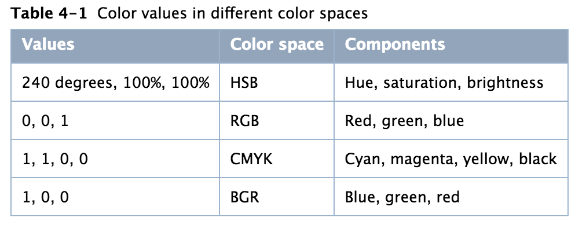
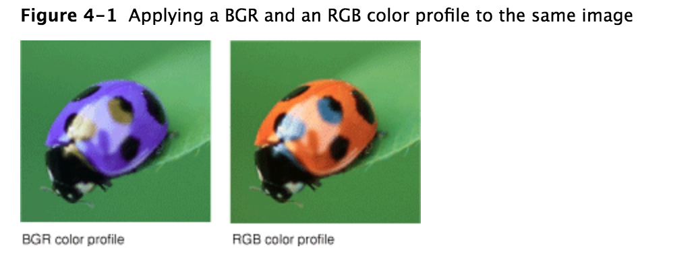
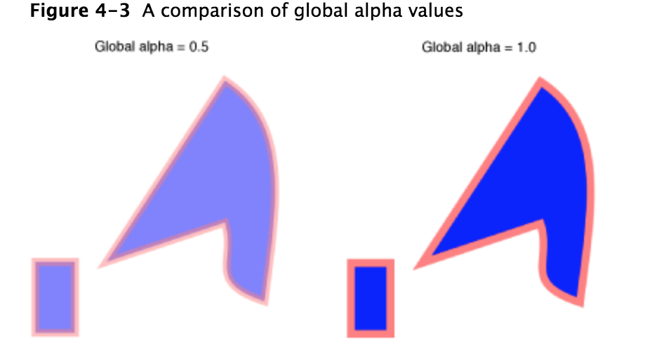
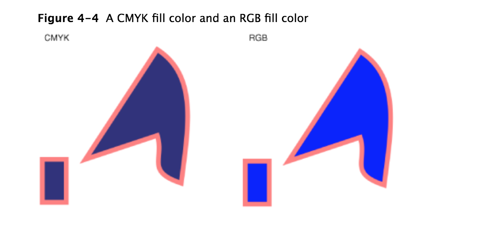

不同设备（显示器，打印机，扫描仪，照相机）以不同的方式处理颜色。 每种设备都有自己所支持的颜色范围。 一种设备能支持的颜色可能在其它设备中无法支持。

为了有效地使用颜色并理解Quartz 2D中用于颜色及颜色空间的函数，我们应该熟悉Color Management Overview中讨论的术语。 该文档讨论了色觉，颜色值，设备依赖和设备颜色空间，颜色匹配问题，渲染意图，颜色管理模块和ColorSync。
<!--more-->
在本章中，您将学习Quartz如何表示颜色和颜色空间以及什么是alpha组件。 本章还讨论如何：

* 创建色彩空间
* 创建和设置颜色
* 设置渲染意图
## 颜色与颜色空间
Quartz中的颜色是用一组值表示。 而颜色空间用于解析这些颜色信息。例如，表4-1列出了在全亮度下蓝色值在不同颜色空间下的值。如果不知道颜色空间及颜色空间所能接受的值，我们没有办法知道一组值所表示的颜色。
Table 4-1  Color values in different color spaces

如果我们提供了错误的颜色空间，我们可能会获得完全不同的颜色，如图4-1所示。 尽管BGR和RGB颜色空间中的绿色被解释为相同，但是红色和蓝色值被翻转。

颜色空间可以有不同数量的组件。 表4-1中的三个颜色空间有三个组件，而CMYK颜色空间有四个组件。值的范围与颜色空间有关。 对于大多数颜色空间，颜色值范围为[0.0, 1.0]，1.0表示全亮度。例如，全亮度蓝色值在Quartz的RGB颜色空间中的值是(0, 0, 1.0)。在Quartz中，颜色值同样有一个alpha值来表示透明度。在表4-1中没有列出该值。
## alpha值
alpha值是图形状态参数，Quartz用它来确定新的绘图对象如何与已存在的对象混合。 在全强度下，新的绘图对象是不透明的。 在零强度下，新的绘图对象是完全透明的。 图4-2显示了五个大的矩形，使用的alpha值分别为1.0,0.75,0.5,0.1和0.0。 当大的矩形变成透明的时候，底下的小的不透明的方形逐渐显现出来。

我们可以将两个对象绘制到page上，而page可以在渲染前通过设置全局的graphics context来设置自己的透明度。图4-3显示了将全局的透明度设置为0.5和1.0的效果。

在标准的混合模式（图形状态的默认模式）中，Quartz使用下面的公式来混合源颜色和目标颜色的组件
`destination =（alpha * source）+（1 - alpha）* destination`

其中源是新绘制的颜色，目标颜色是背景颜色。该公式可用于新绘制的形状和图像。

对于对象透明度，alpha值为1.0时表示新对象是完全不透明的，值0.0表示新对象是完全透明的。0.0与1.0之间的值指定对象的透明度我们可以为所有接受颜色的程序指定一个alpha值作为颜色值的最后一个组件。同样也可以使用CGContextSetAlpha函数来指定全局的alpha值。记住，如果同时设置以上两个值，Quartz将混合全局alpha值与对象的alpha值。

为了使页面本身完全透明，只要图形上下文是窗口或位图图形上下文，我们就可以使用CGContextClearRect函数明确地清除图形上下文的Alpha通道。例如，为图标创建透明度蒙版或者使窗口背景透明时，需要执行此操作。
## 创建颜色空间
Quartz支持颜色管理系统使用标准颜色空间，还支持通用的颜色空间，索引颜色空间和图案的颜色空间。设备颜色空间以一种简便的方法在不同设备间表示颜色。它用于在两种不同设备间的本地颜色空间转换颜色数据。设备依赖颜色空间的颜色在不同设备上显示时效果是一样的，它扩展了设备的能力。基于此，设备依赖颜色空间是显示颜色时最好的选择。

如果应用程序有精确的颜色表示需求，则应该总是使用设备依赖颜色空间。通用颜色空间(generic color space)是一种常用的设备依赖颜色空间。通用颜色空间通过操作系统为我们的应用程序提供最好的颜色空间。它能使在显示器上与在打印机上打印效果是一样的。
【重要】IOS不支持设备依赖颜色空间或通用颜色空间。IOS应用程序必须使用设备颜色空间(device color space)。
### 创建设备依赖颜色空间
要创建与设备无关颜色空间，您需要为Quartz提供特定设备的白色参考点，黑色参考点和伽马值。 Quartz使用这些信息将颜色从源色彩空间转换为输出设备的色彩空间。

Quartz支持的与设备无关的颜色空间以及创建它们的函数是：

1. L * a * b *是Munsell颜色符号系统（通过色调，值和饱和度或色度值指定颜色的系统）的非线性变换。这个色彩空间将感知到的色差与色彩空间中的定量距离相匹配。 L *分量表示亮度值，a *分量表示从绿色到红色的值，并且b *分量表示从蓝色到黄色的值。这个色彩空间是为了模仿人脑如何解码色彩而设计的。使用函数CGColorSpaceCreateLab。
2. ICC是由国际色彩联盟（International Color Consortium）定义的ICC色彩配置文件的色彩空间。 ICC配置文件定义了设备支持的色彩以及其他设备特征的色域，以便可以使用此信息将一个设备的色彩空间准确地转换为另一个设备的色彩空间。该设备的制造商通常提供ICC配置文件。某些彩色监视器和打印机包含嵌入的ICC配置文件信息，以及一些位图格式（如TIFF）。使用函数CGColorSpaceCreateICCBased。
3. 校准后的RGB是与设备无关的RGB颜色空间，它表示与基准白点相关的颜色，基于输出设备可以产生的最白光。使用函数CGColorSpaceCreateCalibratedRGB。
4. 校准后的灰色是与设备无关的灰度色彩空间，表示相对于基准白点的颜色，基准白点是基于输出设备可以生成的最白光。使用函数CGColorSpaceCreateCalibratedGray。
### 创建通用颜色空间
通用颜色空间的颜色与系统匹配。大部分情况下，结果是可接受的。就像名字所暗示的那样，每个“通用”颜色空间(generic gray, generic RGB, generic CMYK)都是一个指定的设备依赖颜色空间。

通过颜色空间非常容易使用；我们不需要提供任何参考点信息。我们使用函数CGColorSpaceCreateWithName来创建一个通用颜色空间，该函数可传入以下常量值：

kCGColorSpaceGenericGray：指定通用灰度颜色空间，该颜色空间是单色的，可以指定从0.0(纯黑)到1.0(纯白)范围内的颜色值。
kCGColorSpaceGenericRGB：指定通用RGB颜色空间，该颜色空间中的颜色值由三个组件(red, green, blue)组成，主要用于彩色显示器上的像素。RGB颜色空间中的每个组件的值范围是[0.0, 1.0]。
kCGColorSpaceGenericCMYK：指定通用CMYK颜色空间，该颜色空间的颜色值由四个组件(cyan, magenta, yellow, black)，主要用于打印机。CMYK颜色空间的每个组件的值范围是[0.0, 1.0]。
### 创建设备颜色空间
设备颜色空间主要用于IOS应用程序，因为其它颜色空间无法在IOS上使用。大多数情况下，Mac OS X应用程序应使用通用颜色空间，而不使用设备颜色空间。但是有些Quartz程序希望图像使用设备颜色空间。例如，如果调用CGImageCreateWithMask函数来指定一个图像作为遮罩，图像必须在设备的灰度颜色空间(device gray color space)中定义。

我们可以使用以下函数来创建设备颜色空间：

* CGColorSpaceCreateDeviceGray：创建设备依赖灰度颜色空间
* CGColorSpaceCreateDeviceRGB：创建设备依赖RGB颜色空间
* CGColorSpaceCreateDeviceCMYK：创建设备依赖CMYK颜色空间
* 创建索引颜色空间和模式颜色空间

索引颜色空间包含一个有256个词目的颜色表，和词目映射到基础颜色空间。颜色表中每个词目指定一个基础颜色空间中的颜色值。使用CGColorSpaceCreateIndexed函数来创建。

模式颜色空间在绘制模式时使用。 使用CGColorSpaceCreatePattern函数来创建。

## 设置和创建颜色
Quartz提供了一套函数用于设置填充颜色、线框颜色、颜色空间和alpha值。每个颜色参数都是图形状态参数，这就意味着一旦设置了，设置将被保存并影响后续操作，直到被修改为止。

一个颜色必须有相关联的颜色空间。否则，Quartz不知道如何解析颜色值。进一步说，说是我们必须为绘制目标提供一个合适的颜色空间。如图4-4所示，左边是CMYK颜色空间中的蓝色填充色，右边是RGB颜色空间中的蓝色填充色。这两个颜色值在理论上是一样的，但只有在相同颜色空间下的相同颜色值显示出来才是一样的。

我们可以使用CGContextSetFillColorSpace和CGContextSetStrokeColorSpace函数来设置填充和线框颜色空间，或者可以使用以下便利函数来设置设备颜色空间的颜色值。

我们在填充及线框颜色空间中指定填充及线框颜色值。例如，在RGB颜色空间中，我们使用数组(1.0, 0.0, 0.0, 1.0)来表示红色。前三个值指定红色值为全强度，而绿色和蓝色为零强度。第四个值为alpha值，用于指定颜色的透明度。

如果需要在程序中重复使用颜色，最有效的方法是通过设置填充色和线框色来创建一个CGColor对象，然后将该对象传递给函数CGContextSetFillColorWithColor及CGContextSetStrokeColorWithColor。我们可以按需要保持CGColor对象，并可以直接使用该对象来改进应用程序的显示。

我们可以调用CGColorCreate函数来创建CGColor对象，该函数需要两个参数：CGColorspace对象及颜色值数组。数组的最后一个值指定alpha值。
## 设置渲染意图(Rending Intent)
渲染意图用于指定Quartz如何将源颜色空间中的颜色映射到处于图形上下文的目标颜色空间的色域内的颜色。如果您没有明确设置渲染意图，则Quartz会使用相对比色渲染意图来渲染除位图（采样）图像之外的所有图形。 Quartz使用感知渲染的意图。

要设置渲染意图，请调用函数CGContextSetRenderingIntent，传递一个图形上下文和以下常量之一：
    * kCGRenderingIntentDefault。使用上下文的默认呈现意图。
    * kCGRenderingIntentAbsoluteColorimetric。绝对色度渲染意图。将输出设备颜色域外的颜色映射为输出设备域内与之最接近的颜色。这可以产生一个裁减效果，因为色域外的两个不同的颜色值可能被映射为色域内的同一个颜色值。当图形使用的颜色值同时包含在源色域及目标色域内时，这种方法是最好的。常用于logo或者使用专色(spot color)时。
    * kCGRenderingIntentRelativeColorimetric。相对色度渲染意图。转换所有的颜色(包括色域内的)，以补偿图形上下文的白点与输出设备白点之间的色差。kCGRenderingIntentPerceptual：感知渲染意图。通过压缩图形上下文的色域来适应输出设备的色域，并保持源颜色空间的颜色之间的相对性。感知渲染意图适用于相片及其它复杂的高细度图片。
    * kCGRenderingIntentPerceptual。通过压缩图形上下文的色域以适应输出设备的色域，保留颜色之间的视觉关系。知觉意图对于照片和其他复杂的，详细的图像是有益的。
    * kCGRenderingIntentSaturation。饱和度渲染意图。把颜色转换到输出设备色域内时，保持颜色的相对饱和度。结果是包含亮度、饱和度颜色的图片。饱和度意图适用于生成低细度的图片，如描述性图表。

