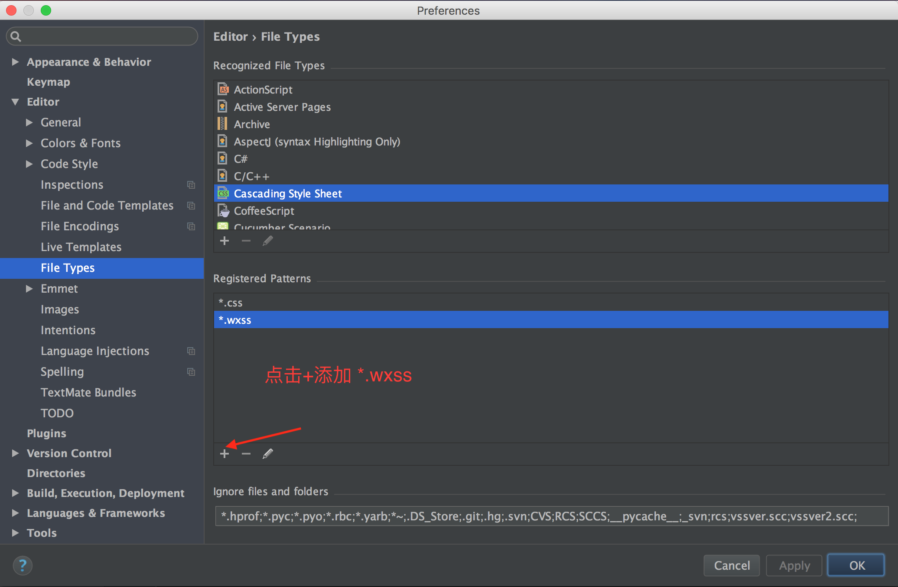

## 让webStorm支持微信小程序开发
<!--more-->
### 1.在WebStorm-> preference->Editor-> FileType->Cascading Style Sheet 添加*.wxss 

### 2.在FileType下HTML 添加*.wxml

## webStorm支持代码代码提醒
### 1.下载[wecharCode.jar](https://link.jianshu.com/?t=https://github.com/miaozhang9/wecharCodejar)
### 2.并放入/Users/你的用户名/Library/Preferences/WebStorm2016.2文件夹下
### 3.然后在webStorm 的 File -> import settings 中导入即可

效果如下图所示

